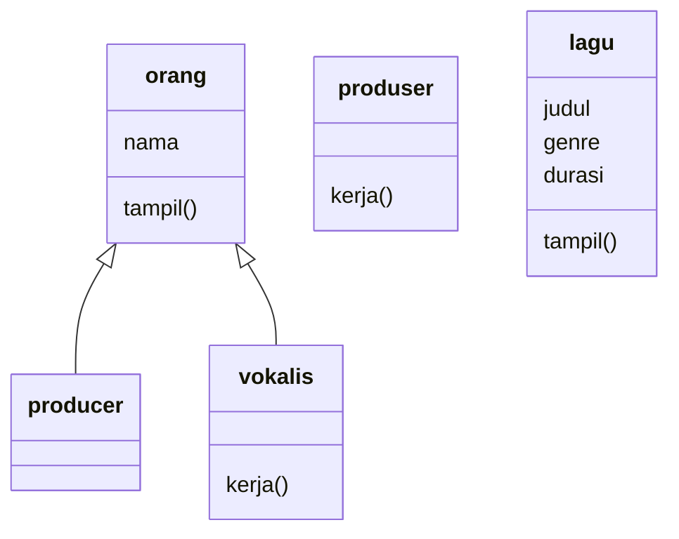

# STRUKDAT-TUGAS2-108
## By Nadia Iqlima | 108
### Problem

Dalam proses produksi lagu biasanya sering terjadi kebingungan dalam mencatat informasi seperti siapa kah yang terlibat dalam pembuatan lagu serta detail lagu yang sedang dikerjakan. Misalnya, dalam satu lagu siapa produser dan vokalisnya, apa genre lagu tersebut, serta berapakah durasinya. Namun dalam kasus ini, Martin sang produser lagu masih mencatat informasi tersebut secara manual dan tidak terstruktur sehingga informasi banyak yang tercampur dan hilang atau bahkan tertukar.

Oleh karena itu, dibuat sebuah program sederhana berbasis konsep Object-Oriented Programming (OOP) untuk membantu Martin dalam mengelola lagu lagu yang telah diproduksinya. Program ini membantu Martin untuk menyimpan data informasi mengenai individu dan berdasarkan perannya, serta menyimpan informasi lagu yang diproduksi, sehingga data menjadi lebih terstruktur, rapih, dan mudah dicari atau ditampilkan kembali saat dibutuhkan.

### Class Diagram

**Penjelasan Class Diagram**
Class Diagram yang telah saya buat ini menggambarkan struktur rancangan sederhana yang akan saya kembangkan menjadi sebuah program mengenai pencatatan informasi produksi lagu yang dibuat. Terdapat empat class, yaitu `orang`, `produser`, `vokalis`, dan `lagu `. class yang pertama yaitu class `orang` berfungsikan sebagai **class induk** yang menyimpan data umum berupa nama, lalu diikuti oleh class `produser` dan `vokalis` yang menjadi turunan dari class tersebut karena keduanya juga sama sama menampilkan orang yang terlibat selama proses pembuatan lagu. Sementara class `lagu` digunakan untuk menyimpan informasi berupa judul, genre, durasi. Disini hubungan class `orang` dengan `produser` dan `vokalis` memiliki hubungan inherritance atau turunan sehingga class tersebut mewarisi atribut dasar seperti `nama` sehingga ngga perlu ditulis ulang.

Di tahap selanjutnya kita akan mulai membahas proses pembuatan program untuk memecahkan masalah tersebut yang dikembangkan dari diagram mermaid ini

## Kode Pemograman
### 1. Orang.java 
```bash
public class orang {
    protected String nama;
    public orang(String nama){
        this.nama = nama;
    }
    public void tampil () {
        System.out.println("nama: "+nama);

    }
}
```
**Penjelasan**
Pada kode ini, class `orang` digunakan untuk menyimpan informasi dasar seperti nama, class ini sekaligus menjadi class induk yang akan digunakan oleh class laim seperti class `produser` dan `vokalis`. Pada atribut `nama` saya memakai access modifier `protected` agar masih bisa di akses oleh class turunannya tanpa perlu dibuat ulang. lalu diberi method `tampil()` untuk menampilkan output nama ke layar.

### 2. Produser.java
```bash
public class producer extends orang {
    public producer(String nama){
        super(nama);
    }
   public void kerja(){
    System.out.println(nama+" adalah produsernya");
   }
    
}
```
**Penjelasan**
Pada class `produser` ini merupakan turunan dari class `orang`, ditandai dengan penggunaan `extends orang`. dengan demikian otomatis class ini memiliki atribut `nama` dari class induknya. class produser ini juga memiliki method `kerja()` yang digunakan untuk menampilkan siapa produser lagu tersebut.

### 3. Vokalis.java
```bash
public class vokalis extends orang {
    
    public vokalis(String nama){
        super(nama);
    }
    public void kerja(){
        System.out.println(nama+" adalah vokalisnya");
    }
}
```
**Penjelasan**
Class `vokalis` hampir sama seperti class produser, keduanya merupakan turunan dari class `orang`. class ini juga menggunakan inherritance untuk mendapatkan atribut `nama`. Method `kerja()` pada class ini digunakan untuk menampilkan peran vokalis dalam produksi lagunya.

### 4. Lagu.java
```bash
public class lagu {
    private String judul;
    private String genre;
    private int durasi;
    
    public lagu(String judul, String genre, int durasi){
        this.judul=judul;
        this.genre=genre;
        this.durasi=durasi;
    }
    public void tampil(){
        System.out.println("judul: "+judul);
        System.out.println("genre: "+genre);
        System.out.println("durasi: "+durasi);
    }
    
    
}
```
**Penjelasan**
Pada class keempat kali ini yaitu class `lagu` digunakan untuk menyimpan beberapa informasi yang dibutuhkan mengenai lagu yang diproduksi. Atribut seperti `judul`, `genre`, `durasi`, dibuat dengan menggunakan access modifier `private` agar tidak bisa diakses sembarangan langsung dari luar class. Data tersebut juga ditampilkan melalui method `tampil()`. Hal ini menunjukan proses encaptulation secara sederhana.

### 5. Main.java
```bash
public class Main {
    public static void main(String[] args){

        producer martin = new producer("Martin");
        vokalis sean = new vokalis("sean");

        lagu lagu1 = new lagu("Go", "pop", 142);

        System.out.println(" --- system pencatatan produksi lagu ---");
        lagu1.tampil();
        System.out.println();

        martin.tampil();
        martin.kerja();

        System.out.println();

        sean.tampil();
        sean.kerja();

        System.out.println();
        System.out.println("semua data produksi telah dicatat");

    }
    
}
```
**Penjelasan**
Class `Main` merupakan bagian penting dan utama dalam program untuk menjalankan seluruh kode. didalam class ini ada beberapa object seperti `produser`, `vokalis`, dan `lagu`. program ditujukan untuk menampilkan informasi lagu dan peran dari masing masing orang yang terlibat. class ini juga berfungsi sebagai penghubung dari semua class agaar dapat berjalan dalam 1 program.

### Penjelasan OOP yang Digunakan
| Konsep OOP | Penjelasan |
|-----------|-----------|
| Class dan Object | Class disini berfungsi sebagai cetakan dalam pembuatan object seperti `produser`, `vokalis`, dan `lagu`. |
| Attribute | Attribute berfungsi sebagai penyimpan datanya, seperti `nama`, `judul`, `genere`, dan `durasi`. |
| Method | Method digunakan untuk menampilkan setiap data dan peran dari setiap object. |
| Constructor | Comstructor digunakan untuk mengisi nilai awal saat object dibuat. |
| Inheritance | Inherritance digunakan pada class `produser` dan `vokalis` yang mewarisi dari class `orang`. |
| Encapsulation / Access Modifier | program ini juga memakai acess modifier seperti `private`, `public`, dan `protected`. Atribut pada class `lagu` dibuat private karena untuk menjaga agar data tersebut tidak gampang diakses langsung dari luar class, sedangkan atribut `nama` pada class `orang` dibikin `protected` agar turunan bawahnya tetap bisa mengakses.  |

### Keunikan


